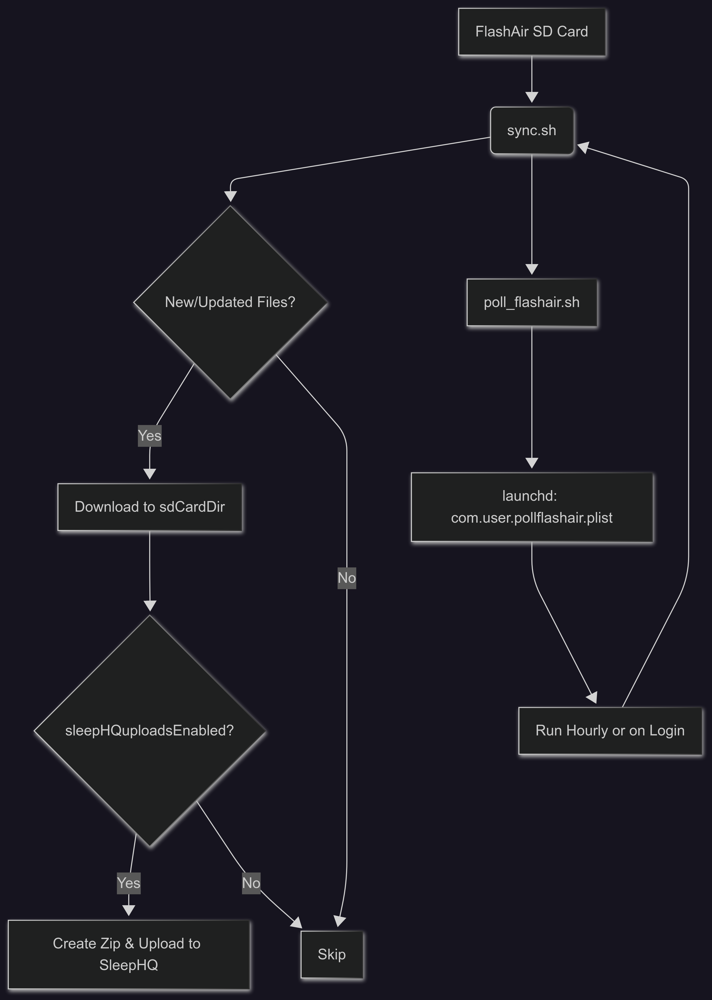

# FlashAir-to-SleepHQ

Based initially on the EZShare CPAP sync script by iitggithub (MIT License at https://github.com/iitggithub/ezshare_cpap), this project has been adapted and extended to support Toshiba FlashAir Wi-Fi SD cards, automating the syncing of CPAP data to SleepHQ. Credit to the original developer for the inspiration and foundational code; this version has evolved significantly, yet it acknowledges that heritage.

This repository contains scripts to synchronize data from a Toshiba FlashAir Wi-Fi SD card to SleepHQ, a sleep data management platform. It supports macOS and Linux, with automation via launchd on macOS. 

### Files

| File                                | Description |
|-------------------------------------|-------------|
| **sync.sh**                         | The main synchronization script. It connects to your FlashAir SD card, downloads new or updated sleep data (e.g., CPAP logs from the DATALOG directory), and optionally uploads it to SleepHQ via their API. It supports Wi-Fi switching between home and FlashAir networks, parallel file downloads, and configuration storage in the macOS keychain or Linux config files (`~/.flashair`). |
| **poll_flashair.sh**                | A lightweight wrapper script that calls `sync.sh` to enable periodic automation. It resolves the path to `sync.sh` dynamically, checks its existence and executability, and logs output to `sync-startup-log.txt` and errors to `sync-error-log.txt`. |
| **com.user.pollflashair.plist.template** | A template for a macOS launchd property list file to automate `poll_flashair.sh`. Users must customize it with their local paths to schedule runs (default: every hour or on login). |
| **FlashAir Config.md**              | A guide for configuring the Toshiba FlashAir SD card's CONFIG file, including setting the static IP, Wi-Fi mode, SSID, and password. |

## System Overview

### Flowchart and Description
The synchronization process involves multiple components working together. Below is a flowchart illustrating the workflow:



### Flowchart Description

| Component | Description |
|-----------|-------------|
| **launchd (com.user.pollflashair.plist)** | A macOS system service that schedules and triggers the automation process, running `poll_flashair.sh` hourly or on login. |
| **poll_flashair.sh** | A wrapper script that executes `sync.sh`, resolving its path dynamically and logging output to `sync-startup-log.txt` and errors to `sync-error-log.txt`. |
| **sync.sh** | The core script that connects to the FlashAir SD card (IP 192.168.1.50), checks for new or updated files since the last run (tracked in `.sync_last_run_time`), downloads them to a local directory (e.g., `SD_Card`), and, if `sleepHQuploadsEnabled` is true, creates a zip file and uploads it to SleepHQ via their API. |
| **FlashAir SD Card** | The data source, providing sleep data (e.g., DATALOG files) accessed by `sync.sh`. |
| **User Interaction** | Users configure Wi-Fi credentials and optional SleepHQ API details interactively the first time, with command-line flags (e.g., `--skip-sync`) for control.

## FlashAir Setup
1. Connect to FlashAir WiFi (default SSID: flashair_XXXXXXXX, PW: 12345678).
2. Browse http://192.168.0.1/config.cgi.
3. Edit /SD_WLAN/CONFIG: APPMODE=5, APPSSID=your_SSID (e.g., "Playa de Perez"), APPNETWORKKEY=your_PW, CIP=192.168.1.50, APPINFO=SD, APPNAME=FLASH AIR.
4. Save, reboot. Test: Ping 192.168.1.50 on local WiFi.

## Setup Instructions

### Prerequisites
- A Toshiba FlashAir Wi-Fi SD card configured with IP `192.168.1.50` (edit the `flashAirURL` variable in `sync.sh` if different). Note: The FlashAir W-04 model requires a 2.4GHz Wi-Fi spectrum and supports WPA2 security (recommended for secure connections; it also supports WEP and WPA, but WPA2 is the default).
- macOS or Linux system with `curl`, `bash`, and `zip` installed.
- SleepHQ account with API credentials (optional for uploads).
- Wi-Fi network access to both your home network and the FlashAir card.

### Step-by-Step Installation

1. **Clone the Repository**
   ```bash
   git clone https://github.com/ApeWare/FlashAir-to-SleepHQ.git
   cd FlashAir-to-SleepHQ
   ```

2. **Make Scripts Executable**
   Ensure both scripts are executable:
   ```bash
   chmod +x sync.sh
   chmod +x poll_flashair.sh
   ```

3. **Configure `sync.sh`**
   - Open `sync.sh` in a text editor.
   - Update the following variables under "GLOBAL VARIABLES" if needed:
     - `sdCardDir`: Set to your desired local sync folder (e.g., `/Users/yourname/Desktop/SD_Card`).
     - `flashAirURL`: Confirm it’s `http://192.168.1.50/` (matches your FlashAir CONFIG).
     - `sleepHQuploadsEnabled`: Set to `true` if you want automatic SleepHQ uploads.
   - Save and close.

4. **Set Up Wi-Fi Credentials**
   - Run `./sync.sh` for the first time. It will prompt for:
     - FlashAir Wi-Fi SSID (e.g., "ResMed_FlashAir") and password.
     - Home Wi-Fi SSID (e.g., "Playa de Perez") and password.
     - Optional SleepHQ Client UID, Secret, and Device ID if uploads are enabled.
   - On macOS, credentials are stored in the keychain; on Linux, in `~/.flashair`.

5. **Verify `poll_flashair.sh`**
   The repo includes `poll_flashair.sh` as a wrapper. Copy the content from [poll_flashair.sh](https://raw.githubusercontent.com/ApeWare/FlashAir-to-SleepHQ/main/poll_flashair.sh) into a new file named `poll_flashair.sh` if it's not already present, or update your existing file to match the latest version. This script dynamically locates and runs `sync.sh`, logging output. Make it executable: `chmod +x poll_flashair.sh`.
   
7. **Set Up Launchd Automation (macOS)**
   - Copy the `com.user.pollflashair.plist.template` to `~/Library/LaunchAgents/`:
     ```bash
     cp com.user.pollflashair.plist.template ~/Library/LaunchAgents/com.user.pollflashair.plist
     ```
   - Edit the plist file with a text editor (e.g., `nano` or `vim`):
     - Replace `<PATH_TO_SCRIPT>` with the full path to `poll_flashair.sh` (e.g., `/Users/yourname/FlashAir-to-SleepHQ/poll_flashair.sh`).
     - Replace `<PATH_TO_LOGS>` with the directory for logs (e.g., `/Users/yourname/FlashAir-to-SleepHQ`).
   - Load the agent:
     ```bash
     launchctl load ~/Library/LaunchAgents/com.user.pollflashair.plist
     ```
   - Verify it’s running: `launchctl list | grep pollflashair`.
   - (Optional) Start immediately: `launchctl start com.user.pollflashair` or reboot to test on login.

8. **Test the Setup**
   - Ensure your FlashAir card is inserted and Wi-Fi is active.
   - Run `./sync.sh` manually to test. Check for errors in the terminal or `sync-error-log.txt`.
   - If using launchd, wait for the next interval (default 1 hour) or force a run with `launchctl start com.user.pollflashair`.

### Usage
- **Manual Sync**: Run `./sync.sh` anytime to sync data.
- **Automated Sync**: The launchd agent runs `poll_flashair.sh` hourly, executing `sync.sh`.
- **Optional Flags**: Use `./sync.sh --help` for options like `--skip-sync` or `--full-sync`.

### Troubleshooting
- **Connectivity Issues**: Ensure the FlashAir IP matches `flashAirURL`. Check Wi-Fi credentials.
- **Log Files**: Review `sync-startup-log.txt` and `sync-error-log.txt` for details.
- **Permission Warning**: macOS may flag "unidentified developer" in Login Items. Right-click `poll_flashair.sh` > Open to approve, or ad-hoc sign with `codesign --force --sign - poll_flashair.sh` (local use only; warning may persist for distribution).
- **Poll Timestamp 0/1969**: FlashAir API bug—edit poll_flashair.sh to parse folder name: `folder_time=$(date -j -f "%Y%m%d" "${name}" "+%s" 2>/dev/null || echo 0)`
- **No Detection**: Ensure 10 files in DATALOG/YYYYMMDD (5 .edf + 5 .crc with prefixes). Check debug output.
- **Upload Fails**: Verify credentials; add retries to API calls in sync.sh.
- **WiFi Issues**: Uncomment connection logic in sync.sh.
- Run shellcheck: `shellcheck *.sh` for linting.

### Contributing
Feel free to fork, submit issues, or pull requests to improve this tool for the SleepHQ community!

### License
[MIT License](LICENSE)
```
